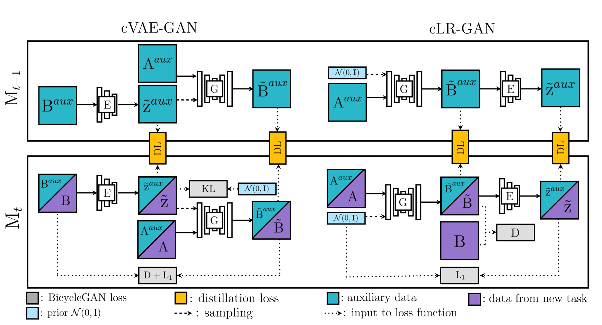

# LifeLong-Gan

### Requirements

* Tensorflow 2.0.0
* Tensorlayer 2.0
* Python 3.6
* Numpy
* Tqdm

### Model

<div align="center"></div>

### Prepare data

* Create a folder `data` in the project directory.
* You can run `download_dataset.sh` in folder datasets to download the images or directly put the images in folder `data`, training data in a subdirectory `train` and test data in `val`.

### Run

* Training

  ``` bash
  python train.py --tasks edges2shoes+facades
  ```
  Tasks edges2shoes and facades will be trained in turn. You can replace them with your datasets and concatenate the task names with "+". More training settings can be found in `params.py`.

* Evaluation

  ```bash
  python evaluate.py --tasks edges2shoes+facades
  ```
  The evaluation results can be found in subdirectory `samples`.

  

### Reference

* [1] Lifelong GAN: Continual Learning for Conditional Image Generation. ICCV, 2019

* [2] Toward Multimodal Image-to-Image Translation. NeurIPS, 2017.